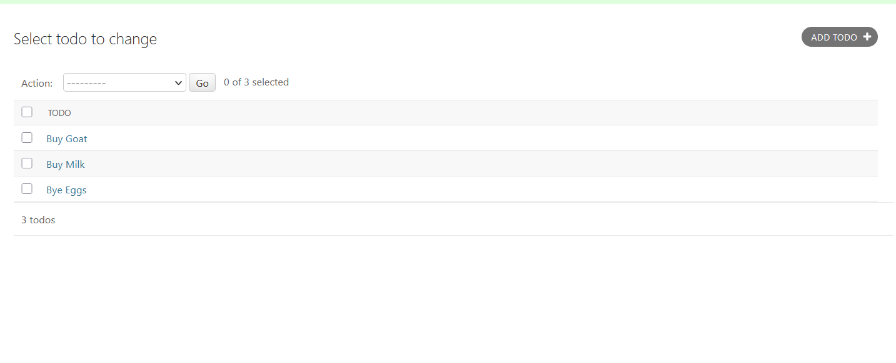

first create model for todo 

    class Todo(models.Model):
        title = models.CharField(max_length=200)
        description = models.TextField()
        completed = models.BooleanField(default=False)
        created_at = models.DateTimeField(auto_now_add=True)
        updated_at = models.DateTimeField(auto_now=True)
        
    def __str__(self):
        return self.title

and go to admin of todo and add

    from .models import Todo
    admin.site.register(Todo)                         python manage.py runserver   

    python manage.py migrate
    python manage.py makemigrations 
    python manage.py migrate
    python manage.py createsuperuser

go to admin panel and add follow this pic

in this views.py of todo

    class ToDoListView(View):
    def get(self, request):
        return HttpResponse("This is the todo list view.")
    def post(self, request):
        return HttpResponse("form submitted successfully")

in this urls.py of todo 

     path('todos/', ToDoListView.as_view(), name='todo_list'),  

in this views.py of todo

     class ToDoListApiView(View):
        def get(self, request):
            todos = Todo.objects.all()
            formatted_todo = []
            for todo in todos:
                formatted_todo.append({
                    'id': todo.id,
                    'title': todo.title,
                    'description': todo.description,
                    'completed': todo.completed,
                    'created_at': todo.created_at.strftime('%Y/%m/%d %H:%M:%S'),
                    'updated_at': todo.updated_at.strftime('%Y/%m/%d %H:%M:%S')
                })
            formatted_todo = json.dumps(formatted_todo, indent=4)    
            return HttpResponse(formatted_todo, content_type="application/json")     